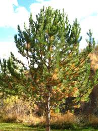
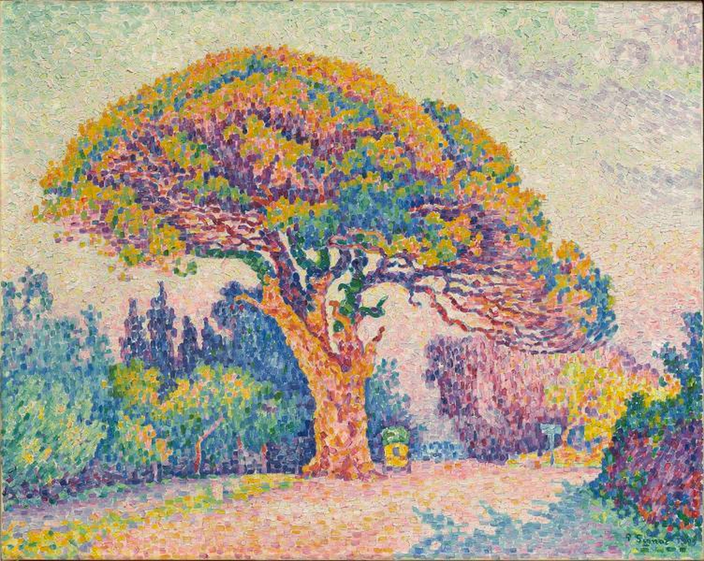
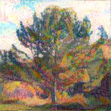

# Neural Style in TensorFlow

Hello!
This repo contains a Tensorflow implementation of the neural style paper by Gatys, et al. It was my first time using Tensorflow, so the code is extremely simple and easy to follow. 

To run the program, call 
    
    python neural_style.py <style_image_path> <content_image_path>

Here's a quick example of the output after 230 iterations:

Best,
Lawrence 
